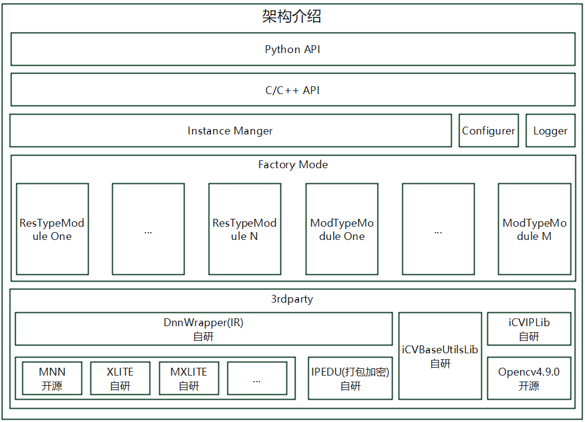

# iCVFrameWork

# 更新记录
|时间|更新内容|作者|
|---|---|---|
|2024-05-22|新建文档|沙文(Chauvin)|
|2024-06-61|更新框架图|沙文(Chauvin)|

# 仓库说明
A CV C++ Engine FrameWork.

## 功能简介
iCVFrameWork 是一个视觉AI引擎本地C++ SDK开发框架，改框架跨平台，支持一键编译，已经在多个产品中推广使用。

## 框架特性
- cmake构建，跨平台支持windows、linux、qnx、android、ios一键编译；
- 工厂模式：原子能力引擎包集合，简单易懂；
- 轻量级：支持多实例多线程调用；
- 依赖组件全部来自自研或者开源框架，通过git submodule统一管理；
- 使用推理组件代理层DnnWrapper将深度学习推理组件和SDK解耦，方便深度学习推理组件的随时替换；

## 框架架构

## 开发维护
[沙文(Chauvin)](mailto:shawen@mail.ustc.edu.cn)